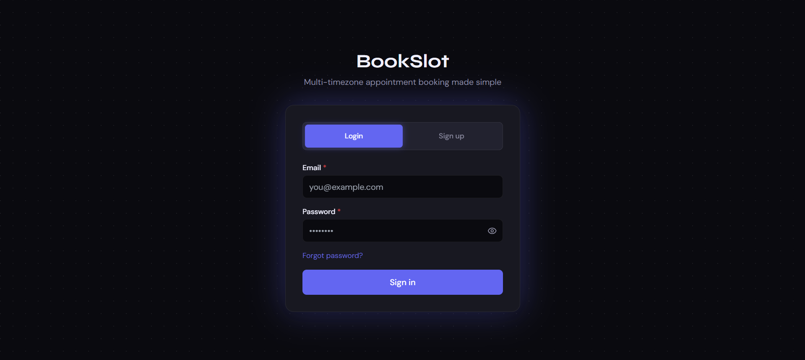
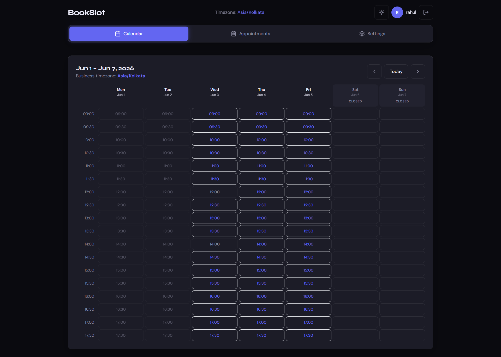
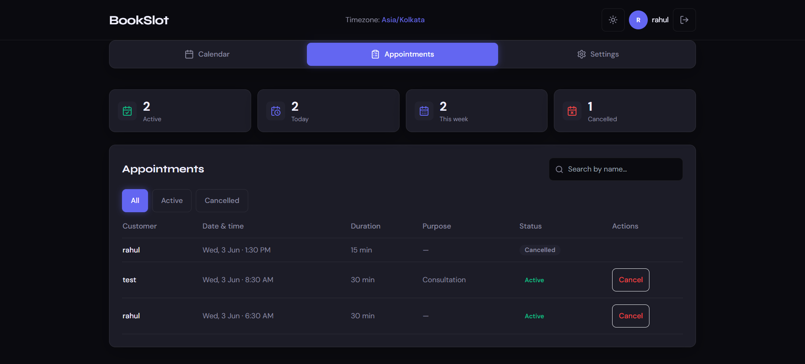
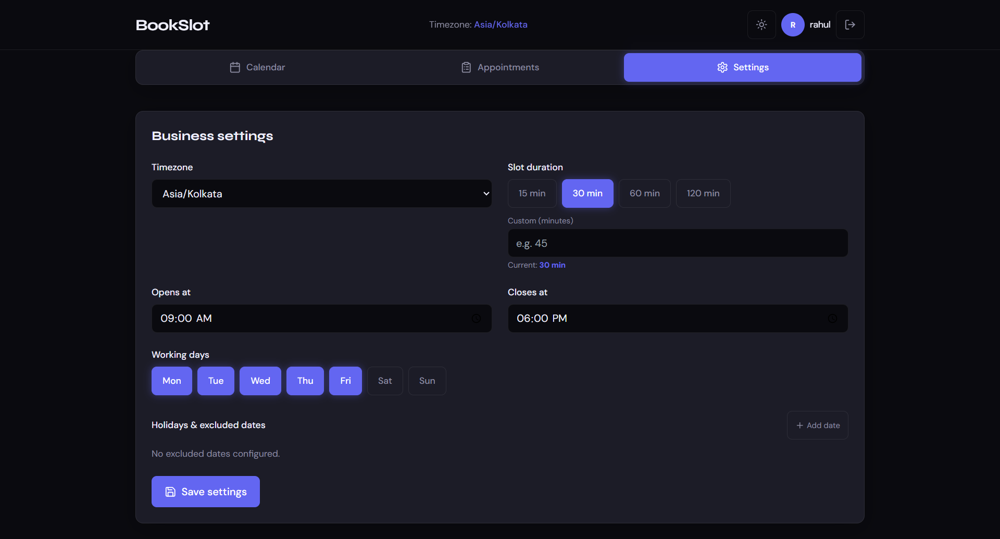

<div align="center">

# 🗓️ BookSlot

**Multi-Timezone Appointment Booking System**

Live link: https://appointment-booking-flame.vercel.app/

A full-stack scheduling platform built with FastAPI, React, TypeScript, and pytz.
Book appointments across timezones with concurrency-safe slot management, holiday exclusions, and a live calendar UI.

[](https://fastapi.tiangolo.com)
[](https://react.dev)
[](https://typescriptlang.org)
[](https://tailwindcss.com)
[](https://sqlite.org)

</div>

---

## 📸 Screenshots

### 🔐 Login


### 📝 Sign Up


### 🗓️ Calendar


### 📋 Appointments


### ⚙️ Settings



## ✨ Features

- **Timezone-aware calendar** — all slots rendered in the business's local timezone, not the browser's
- **Smart slot engine** — filters by business hours, active weekdays, holidays, past times, and existing bookings
- **Concurrency-safe booking** — per-slot async locks prevent double bookings under simultaneous requests
- **Business config panel** — set timezone, duration, working hours, active days, and holiday exclusions
- **Appointments dashboard** — view, search, filter, and cancel bookings with customer details
- **Auth system** — JWT-based register/login with protected routes
- **Light & dark theme** — persisted in localStorage, respects system preference on first load
- **Fully responsive** — week view on desktop, single-day view on mobile

---

## 🛠️ Tech Stack

| Layer | Technology |
|-------|-----------|
| Backend | FastAPI, SQLAlchemy, SQLite, pytz, python-jose |
| Frontend | React 18, TypeScript, Vite, Tailwind CSS |
| Auth | JWT (HS256), passlib + bcrypt 4.0.1 |
| Date/Time | date-fns, date-fns-tz |

---

## 📋 Prerequisites

- Python **3.11+**
- Node.js **18+**
- npm **9+**

---

## 🚀 Quick Start

### 1. Clone the repository

```bash
git clone https://github.com/your-username/appointment-booking.git
cd appointment-booking
```

### 2. Backend

```bash
cd backend

# Create and activate virtual environment
python -m venv venv
source venv/bin/activate        # macOS / Linux
# venv\Scripts\activate         # Windows PowerShell

# Install dependencies
pip install -r requirements.txt

# Copy environment file and set your JWT secret
cp .env.example .env
# Edit .env and set JWT_SECRET to any long random string

# Start the server
uvicorn main:app --reload --port 8000
```

Backend runs at → `http://localhost:8000`
Interactive API docs → `http://localhost:8000/docs`

### 3. Frontend

```bash
cd frontend

npm install

cp .env.example .env
# .env already points to http://localhost:8000 by default

npm run dev
```

Frontend runs at → `http://localhost:5173`

---

## ⚙️ Environment Variables

### Backend — `backend/.env`

| Variable | Description | Default |
|----------|-------------|---------|
| `JWT_SECRET` | Secret key for signing JWT tokens | *(required)* |
| `JWT_ALGORITHM` | JWT signing algorithm | `HS256` |
| `ACCESS_TOKEN_EXPIRE_MINUTES` | Token expiry duration | `1440` |

### Frontend — `frontend/.env`

| Variable | Description | Default |
|----------|-------------|---------|
| `VITE_API_URL` | Backend base URL | `http://localhost:8000` |

---

## 🗄️ Database

SQLite is used by default — no setup required. The database file `bookslot.db` is created automatically in the `backend/` directory on first run.

On startup, the backend seeds one default business configuration:

| Field | Value |
|-------|-------|
| `smb_id` | `00000000-0000-0000-0000-000000000001` |
| Timezone | `Asia/Kolkata` |
| Slot duration | 30 minutes |
| Business hours | 09:00 – 18:00 |
| Working days | Monday – Friday |

---

## 📁 Project Structure
```bash
appointment-booking/
├── backend/
│   ├── main.py                 # App entry point, CORS, startup seed
│   ├── database.py             # SQLAlchemy engine and session
│   ├── models.py               # SMBConfig, Appointment, User ORM models
│   ├── schemas.py              # Pydantic request/response schemas
│   ├── auth_utils.py           # JWT creation, password hashing/verification
│   ├── routers/
│   │   ├── auth.py             # /api/auth — register, login, me
│   │   └── booking.py          # /api/booking — config, slots, appointments
│   ├── services/
│   │   ├── slot_engine.py      # Timezone-aware slot generation logic
│   │   └── booking_service.py  # Concurrency-safe appointment creation
│   ├── requirements.txt
│   ├── .env.example
│   └── bookslot.db             # Auto-created SQLite database (gitignored)
│
├── frontend/
│   ├── src/
│   │   ├── components/
│   │   │   ├── CalendarGrid.tsx    # Week/day calendar with slot rendering
│   │   │   ├── BookingModal.tsx    # Appointment booking form
│   │   │   ├── ConfigPanel.tsx     # Business settings form
│   │   │   └── SlotCell.tsx        # Individual calendar cell
│   │   ├── pages/
│   │   │   └── AuthPage.tsx        # Login and sign up
│   │   ├── hooks/
│   │   │   ├── useSlots.ts         # Slot fetching hook
│   │   │   └── useConfig.ts        # Config fetching/updating hook
│   │   ├── context/
│   │   │   └── AuthContext.tsx     # Auth state, login, logout
│   │   ├── api/
│   │   │   └── client.ts           # Axios instance with auth headers
│   │   ├── types/
│   │   │   └── index.ts            # Shared TypeScript interfaces
│   │   ├── App.tsx
│   │   └── main.tsx
│   ├── .env.example
│   ├── package.json
│   ├── tsconfig.json
│   └── vite.config.ts
│
└── README.md


```

## 🔌 API Reference

### Auth

| Method | Endpoint | Description |
|--------|----------|-------------|
| `POST` | `/api/auth/register` | Create a new account |
| `POST` | `/api/auth/login` | Login and receive JWT token |
| `GET` | `/api/auth/me` | Get current authenticated user |

### Booking

| Method | Endpoint | Description |
|--------|----------|-------------|
| `GET` | `/api/booking/config/{smb_id}` | Get business configuration |
| `POST` | `/api/booking/config` | Create business configuration |
| `PUT` | `/api/booking/config/{smb_id}` | Update business configuration |
| `GET` | `/api/booking/slots` | Get available slots for a time range |
| `POST` | `/api/booking/appointments` | Book an appointment |
| `GET` | `/api/booking/appointments` | List appointments for a business |
| `PATCH` | `/api/booking/appointments/{id}/cancel` | Cancel an appointment |

Full interactive docs available at `http://localhost:8000/docs` when the backend is running.

---

## 🔐 Known Setup Issue — bcrypt Compatibility

If you see `error reading bcrypt version` or a 500 on `/api/auth/register`, run:

```bash
pip uninstall bcrypt passlib -y
pip install "bcrypt==4.0.1" "passlib[bcrypt]==1.7.4"
```

This fixes a version mismatch between newer `bcrypt` (4.1+) and `passlib`. The `requirements.txt` already pins the correct versions.

---

## 🤝 Contributing

1. Fork the repository
2. Create a feature branch: `git checkout -b feat/your-feature`
3. Commit your changes: `git commit -m "feat: add your feature"`
4. Push and open a pull request

---
